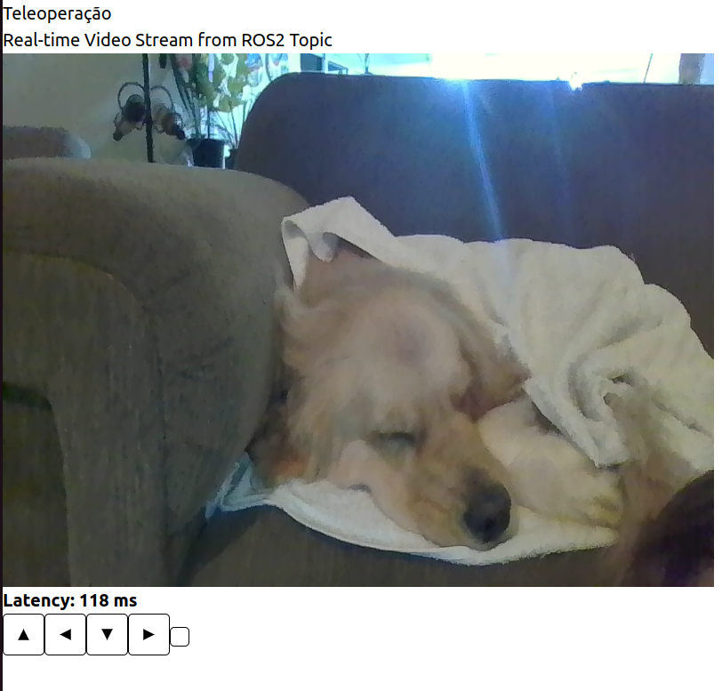

# Ponderada - Turtlebot teleoperado

Desenvolvido por Isabelle Beatriz Vasquez Oliveira

**Esse projeto têm como referência o código desenvolvido no projeto SugarZ3ro!**

Este projeto é capaz de realizar a leitura das teclas pressionadas pelo usuário na interface, transmitir imagens em tempo real e latencia das imagens transmitidas pela camera. Todas essas informações são transmitidas a partir de um publisher no tópico adequado, provocar a movimentação do Turtlebot3 e transmisãod e informações.

O código desenvolvido para a transmissão de video utiliza ROSBridge para realizar a comunicação entre o backend e o frontend e está localizado no arquivo `sender.py` que deve ser executado na raspberry pi onde a camera dese estar conectada. Mas antes disso, é importante instalar e iniciar o ROSBridge pelos seguintes comandos: 
`sudo apt install ros-humble-rosbridge-suite`
`ros2 launch rosbridge_server rosbridge_websocket_launch.xml`

Após o ROSBridge ser iniciado, já é possivel iniciar o arquivo `sender.py`, tambem na raspberry pi.

Para reproduzir o vídeo da webcam, foi desenvolvido um componente para o frontend em `React.js` com `Vite.js`, encontrado no arquivo `camera.jsx`. Esse componente contém um script que recebe as imagens da câmera por meio da comunicação do ROSBridge via WebSocket executada no arquivo sender.py. É importante verificar se o IP do computador que está executando o arquivo `sener.py` é o mesmo IP no arquivo camera.jsx na seguinte linha:
`url: 'ws://10.128.0.30:9090'`

O mesmo vale para o IP encontrado no arquivo `rosbridge_moviment.jsx` (responsavel pela movimentação do Turtlebot3) que tambem se comunica com o robô pelo frontend por meio do ROSBridge. 
```
ros.current = new ROSLIB.Ros({
      url: 'ws://10.128.0.30:9090'
    });
```

O calculo da latencia tambem foi desenvolvido nesse projeto no arquivo `camera.jsx` a partir da diferenca entre o tempo atual pelo tempod e envio dessa imagem. O calculo com mais detalhes pode ser encontrado no arquivo mencionado. 

Para executar o frontend, é necessario acessar a seguinte pasta: `/ponderada-S7-M6/ponderada-S5-M6/src/frontend`

Ao acessar a pasta frontend, deve-se executar os seguintes comandos: 

`npm i` 
`npm run build`
`npm run dev`

Ao executar esses comando, deve ser possivel visualizar a interface ao digitar o seguinte caminho na url no navegador de sua prefenrencia: `http://localhost:5173/teleopScreen`

A interface final pode ser vizualizada a seguir: 
    

O vídeo de demonstração do funcionamento do projeto pode ser encontrado no link a seguir: https://youtu.be/ZsJmXcjVQBI

## Como executar?

**Os requisitos de execução e o tutorial de execução têm como referência a documentação do projeto SugarZ3ro!**

Para executar o projeto corretamente, o usuário deve ter os seguintes pré-requisitos: 

- Python3 e Git instalados no computador usado para operar o robo;
- ROS2 e Pacote ROS do Turtlebot 3 instalados no sistema operacional (Linux Ubuntu) da Raspberry do Turtlebot 3 e do computador usado para operá-lo remotamente;
- Raspberry do Turtlebot 3 e computador usado para operá-lo remotamente conectados na mesma rede wi-fi.

Para executar o programa, o usuario deve seguir os seguintes passos:

  **Sistema operacional da Raspberry contida no Turtlebot 3**
  
No sistema operacional da Raspberry contida no Turtlebot 3 a ser controlado, abra uma janela de terminal e digite os seguintes comandos para limitar a comunicação via ROS a um domínio com ID 5 dentro da rede:

`echo 'export ROS_DOMAIN_ID=5' >> ~/.bashrc`

`source ~/.bashrc`

    Também é necessário realizar a comunicação via SSH. Para isso, é necessário seguir os seguintes passos: 
    No sistema operacional da Raspberry do Turtlebot 3, abra uma janela de terminal e clone e dê build no repositório do projeto no diretório de sua preferência através dos comandos:

    git clone https://github.com/IsabelleVOliveira/ponderada-S5-M6.git
        
    colcon build
    
    Na mesma janela de terminal, digite os seguintes comandos para instalar o pacote responsável por iniciar um servidor SSH e executá-lo.
    sudo apt install openssh-server
    
    sudo systemctl enable ssh
    
    sudo ufw allow ssh
    
    sudo systemctl start ssh
    
    Na mesma janela de terminal, digite o seguinte comando para iniciar a comunicação entre a Raspberry e o microcontrolador do robô, bem como torná-lo apto a receber comandos de movimentação remotamente:
    ros2 launch turtlebot3_bringup robot.launch.py
    
    No sistema operacional do computador que será utilizado para controlar o robô de maneira remota, abra uma janela de terminal e digite o seguinte comando:
    ssh user@server

    Digite a senha de usuário que será solicitada pelo terminal.

Na mesma janela de terminal, digite o seguinte comando para iniciar a comunicação entre a Raspberry e o microcontrolador do robô, bem como torná-lo apto a receber comandos de movimentação remotamente:
`ros2 launch turtlebot3_bringup robot.launch.py`

**Computador que vai controlar o robo**

No sistema operacional do computador que será utilizado para controlar o robô de maneira remota, abra uma janela de terminal no diretório de sua preferência e clone o repositório através do seguinte comando:
`git clone https://github.com/IsabelleVOliveira/ponderada-S5-M6.git`

Na mesma janela de terminal, digite o seguinte comando para iniciar o build do workspace:
`colcon build`

Na mesma janela de terminal, digite o seguinte comando para habilitar o uso do pacote criado:
`source install/local_setup.bash`

Na mesma janela de terminal, digite os seguintes comandos para limitar a comunicação via ROS a um domínio com ID 5 dentro da rede:
`echo 'export ROS_DOMAIN_ID=5' >> ~/.bashrc`

`source ~/.bashrc`

Por fim, na mesma janela de terminal, digite o seguinte comando para executar o script responsável por inicializar a CLI para controle de movimentação do robô:
`ros2 run run start_moving`


